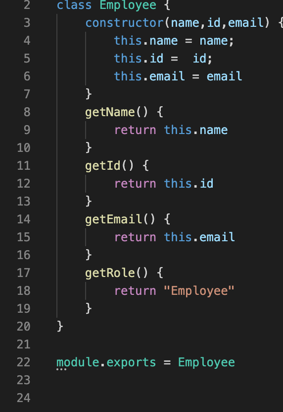
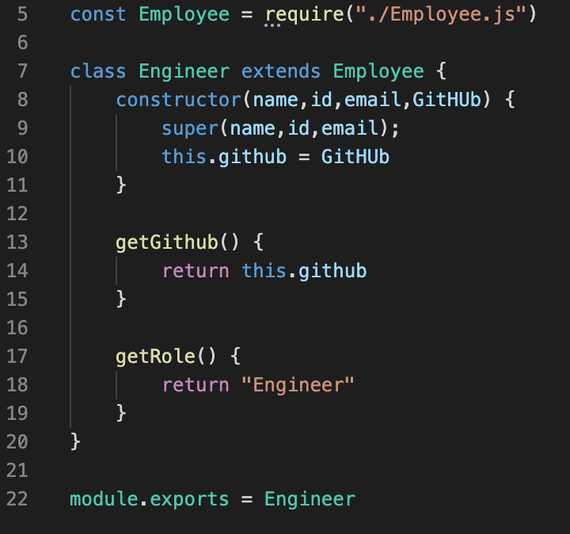
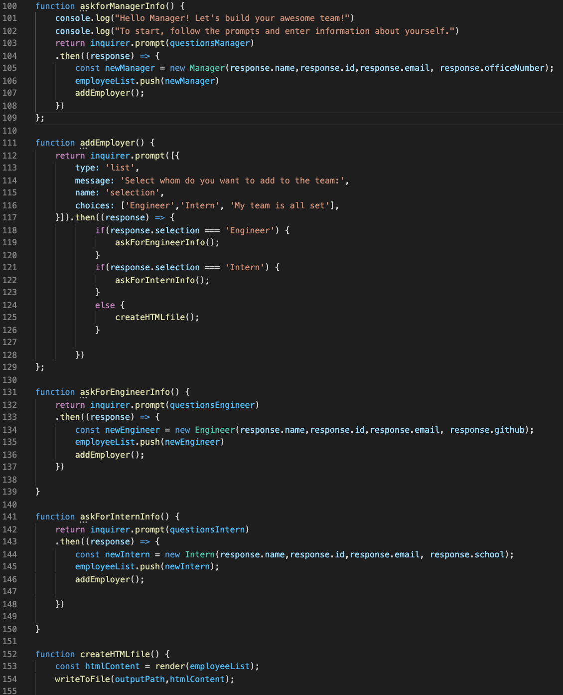
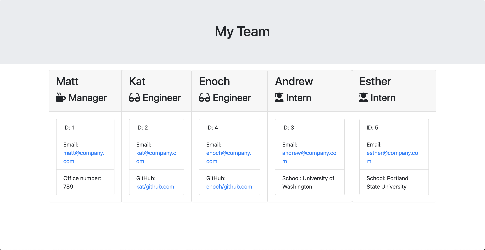
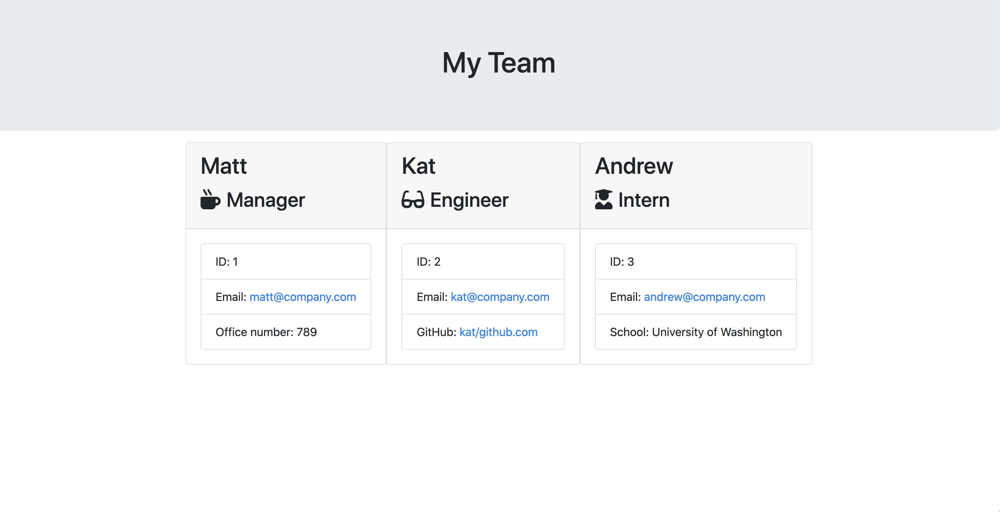

# Engineering Team Generator 

## Table of Contents
1. [ Description ](#desc)
2. [ Task ](#task)
3. [ Link to screen recording ](#link)
4. [ Structure ](#structure)
5. [ Finished product ](#final)

## 1. Description
This repository contains code for the application that allows to take in information about employees from CLI and generate an HTML webpage that displays summaries for each person. 

## 2. Task
Task is to build a test-driven application that takes in information about employees and dynamically generates an HTML webpage that displays summaries for each person.
The application prompts the user for information about the team manager and then information about the team members. The user can input any number of team members, and they may be a mix of engineers and interns. When the user has completed building the team, the application will create an HTML file that displays a nicely formatted team roster based on the information provided by the user. 
Prior to building the application itself, it was required to create a parent Employee class, and children sublasses that inherit parent's behavior but also have some unique properties. The developed objects had to pass all unit tests.  

## 3. Link to screen recording
Screen recording capturing how the file is generated: 

## 4. Structure
The folder contains  *.json* pacakage, node_modules, lib folder containing class files and htmlRenderer file, test folder containing unit tests for each class, output folder containing the developed *team.html*, templates folder, containing *html* templates for each class, *app.js* containing the main logic of the application and supplemental media. 
The screenshots below show the definitions of the parent Employee class and parent Engineer subclass.

The *app.js* has several functions that construct chaining inquirers which take the information about the manager, then  offers the user to add an engineer, an intern or render the team if it's all set. The team data is stored in a list which is passed to render function to produce the *.html* file. The main functions are displayed in the screenshot below.             

## 5. Finished product
The developed *.html* file is located in the root of this folder: [Link](./output/team.html).

Here are the screenshots of how the page looks like for 3 and 5 team memebers:

